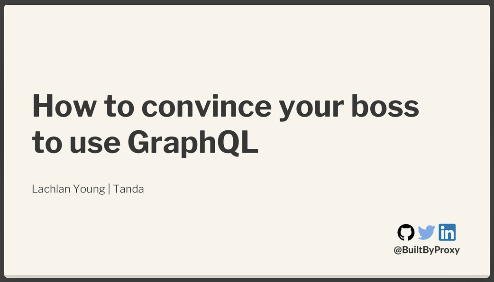

# How to convince your boss to use GraphQL

## Info:
**Who:**  Lachlan Young  
**What:**  Conference Talk  
**When:**  February 21st 2020  
**Where:**  GraphQL Asia Bangalore  

## Description:
GraphQL is rolling out quicker and quicker as the community around it grows and improves what was once just a vision. Yet each addition to our tech stack, brings with it its own core problems, most notably of which is how to replace the old? To date one of the biggest barriers to entry with a GraphQL API is the technical debt of maintaining two APIs or alternatively, the consequences of deprecating the Industry standard in its favour. Fortunately, we can look to our predecessors as this is not the first time our API standard has been challenged. Whilst GraphQL itself is intended to be a layer, connecting two sides of an intricately woven coin of routes, operations and responses. GraphQL faces the same problems REST initially did when attempting to scrub itself clean of SOAP, XML and the like. On the menu today we will be starting with a smooth overview of previous successors, followed by an in-depth comparison of working with both a Server-less private GraphQL Api and, a monolithic Versioned API designed for private and public consumption alike. For dessert a few war stories chased with a generous helping of philosophy around the importance of APIs and how they truly dictate the balance between success and failure of a product.

## Slides:
[](https://speakerdeck.com/builtbyproxy/how-to-convince-your-boss-to-use-graphql)

## Video:
**N/A**

## How to use this code

### SOAP:

1. `yarn`
2. `node index.js`
3. Head to Postman
   1. Your URL is: [http://localhost:8000/wsdl](http://localhost:8000/wsdl)
   2. Your `POST` request's `raw Body` is: 
   ```
    <soapenv:Envelope xmlns:soapenv="http://schemas.xmlsoap.org/soap/envelope/">
    <soapenv:Header/>
    <soapenv:Body>
        <web:Example>
            <web:userName>Lachlan</web:userName>
        </web:Example>
    </soapenv:Body>
    </soapenv:Envelope>
   ```

### REST:
1. `yarn`
2. `node index.js`
3. Head to Postman
   1. Your URL is: [http://localhost:8000/](http://localhost:8000/) or directly [localhost:8000/getUser?userName=Lachlan](localhost:8000/getUser?userName=Lachlan)
   2. Your `GET` request `Params` are:
   ```
    [
        {
            "key":"userName",
            "value":"Lachlans"
        }
    ]
   ``` 

### GraphQL:
1. `yarn`
2. `node index.js`
3. Head to Postman
   1. Your URL is: [http://localhost:8000/](http://localhost:8000/)
   2. Your `POST` request's `GraphQL Body` is:
   ```
    query oneUser {
        User(userName: "Lachlan") {
            firstName
            lastName
            age
        }
    }
   ```

